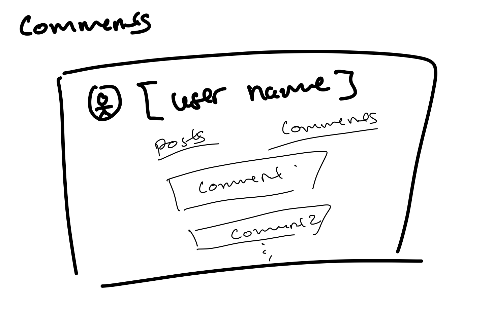
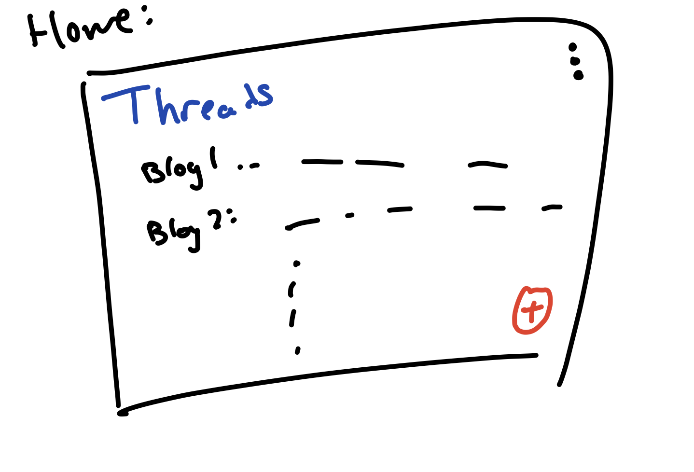
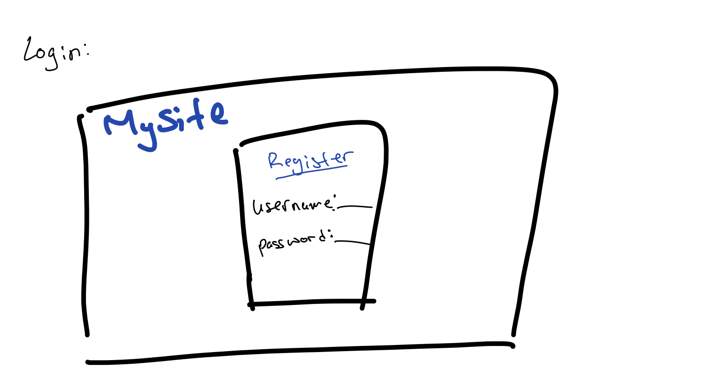
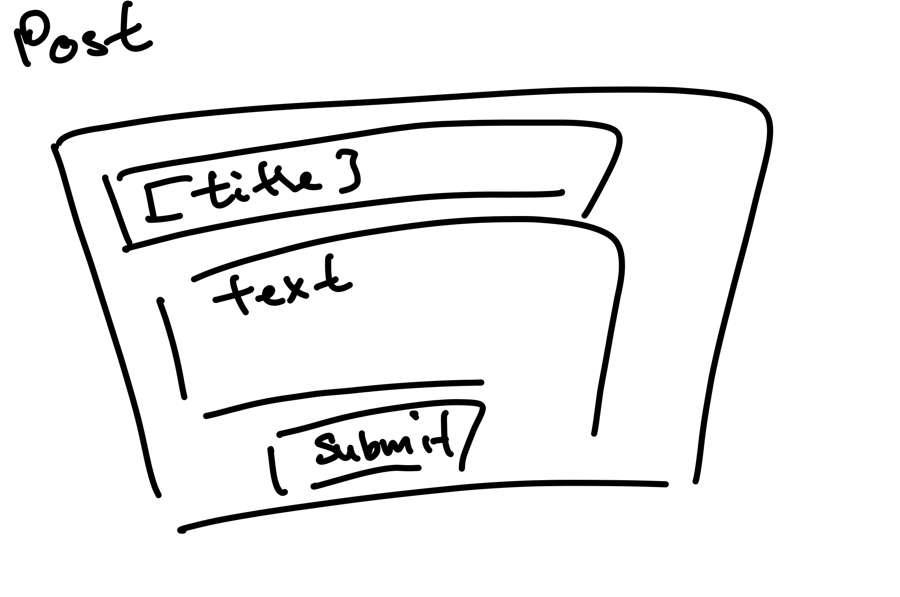
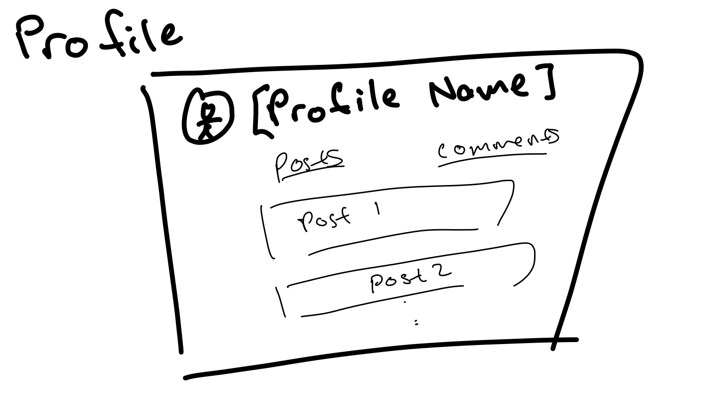
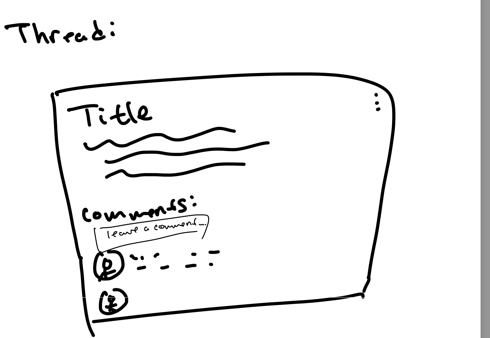

The content below is an example project proposal / requirements document. Replace the text below the lines marked "__TODO__" with details specific to your project. Remove the "TODO" lines.

(BloggingPlatform)


## Overview

I want to make a blogging site where people can make an account and start a discussion thread. Users will be able to view, write, and comment on threads.

## Data Model

The application will store Comments, and Posts
  * Posts can have multiple comments (via reference)


```javascript
{
  _id: "post1",
  title: "Title of the Post",
  content: "Content of the post",
  author: "user123",
  comments: ["comment1", "comment2"]
}
```

```javascript
{
  _id: "comment1",
  content: "This is a comment.",
  author: "user123",
  post: "post1"
}
```

* Post.comments references Comment documents
* Comment.post references a Post document

## [Link to Commented First Draft Schema](db.mjs) 


## Wireframes


/thread/comments - page for viewing a user's comments



/thread/home - home page displaying most recent posts



/thread/login - page for logging into the site



/thread/post - page for adding making a post and starting a thread


/thread/profile - page for viewing all of a user's posts. 


/thread/thread - page for viewing a thread


## Site map

[Site Map](documentation/map.png)

## User Stories or Use Cases

* As a visitor, I want to browse threads so that I can read discussions.
* As a user I like the anonimity provided by the site, I do not want to know who is posting
* As a user, I want to comment on threads so that I can participate in discussions.


## [Link to Initial Main Project File](app.mjs) 

## Annotations / References Used

* NA no code yet
